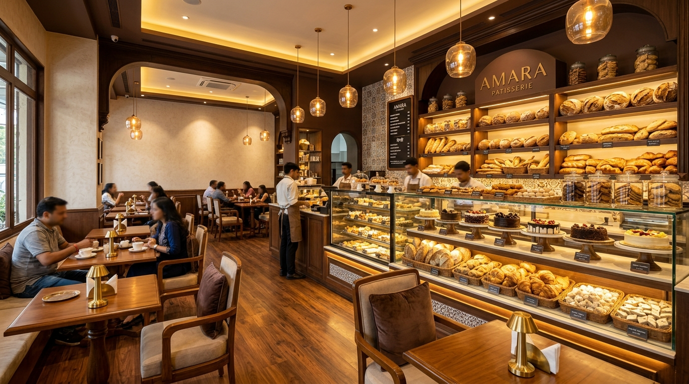

# 🎂 Bake Bliss Café



**Bake Bliss Café** is a modern, responsive web application for a premium bakery and café. It showcases freshly baked artisan breads, handcrafted cakes, pastries, Indian fusion treats like Rasmalai Cake and Kulhad Coffee, and cozy café dining experiences.

---

## 🌟 Key Features

- 🥐 **Artisan Bakery & Pastries**: Detailed showcases of cakes, croissants, brownies, and specialty desserts.
- ☕ **Handcrafted Beverages**: Premium coffee blends, Kulhad coffee, and refreshing drinks.
- 🎨 **Modern & Responsive UI**: Designed with elegant typography (`Playfair Display`, `Poppins`) and glassmorphic micro-animations.
- 📱 **Mobile First**: Fully optimized across desktop, tablet, and mobile browsers.
- ⚡ **SEO Optimized**: OpenGraph & Twitter Meta Tags for social sharing preview cards.

---

## 📁 Project Directory Structure

```text
bakeblisscafe/
├── assets/
│   ├── index-BwY-x0ON.css   # Main stylesheet bundle
│   └── index-D07xibB_.js    # React application bundle
├── images/
│   ├── about_bakery.jpg
│   ├── artisan_bread.jpg
│   ├── black_forest_cake.jpg
│   ├── butter_croissant.jpg
│   ├── cafe_interior.jpg
│   ├── chocolate_truffle_cake.jpg
│   ├── cookies_assorted.jpg
│   ├── cupcakes_assorted.jpg
│   ├── favicon.svg
│   ├── fresh_brownies.jpg
│   ├── hero_bakery.jpg
│   ├── icons.svg
│   ├── kulhad_coffee.jpg
│   ├── pastries_assorted.jpg
│   ├── rasmalai_cake.jpg
│   ├── red_velvet_cake.jpg
│   └── veg_sandwich.jpg
├── .gitignore               # Ignored files (node_modules, build, dist)
├── index.html               # Main entry HTML
├── package.json             # NPM package scripts & dependencies
└── README.md                # Project documentation
```

---

## 🚀 Getting Started

### Prerequisites

Ensure you have [Node.js](https://nodejs.org/) (v16 or higher) installed on your system.

### Installation

1. **Clone the repository:**
   ```bash
   git clone https://github.com/Kanhiya-Gulati/Bakebliss-Cafe.git
   cd Bakebliss-Cafe
   ```

2. **Install dependencies:**
   ```bash
   npm install
   ```

3. **Start local development server:**
   ```bash
   npm start
   ```
   Open `http://localhost:8085` in your browser.

4. **Build production bundle:**
   ```bash
   npm run build
   ```

---

## 🛠️ Built With

- **HTML5 / CSS3 / JavaScript (ES6+)**
- **React.js**
- **Google Fonts** (`Playfair Display` & `Poppins`)
- **Serve** (Static Server)

---

## 👨‍💻 Author

**Kanhiya Gulati**  
Computer Application Student @ COER University, Roorkee, Uttarakhand.  
GitHub: [@Kanhiya-Gulati](https://github.com/Kanhiya-Gulati)
